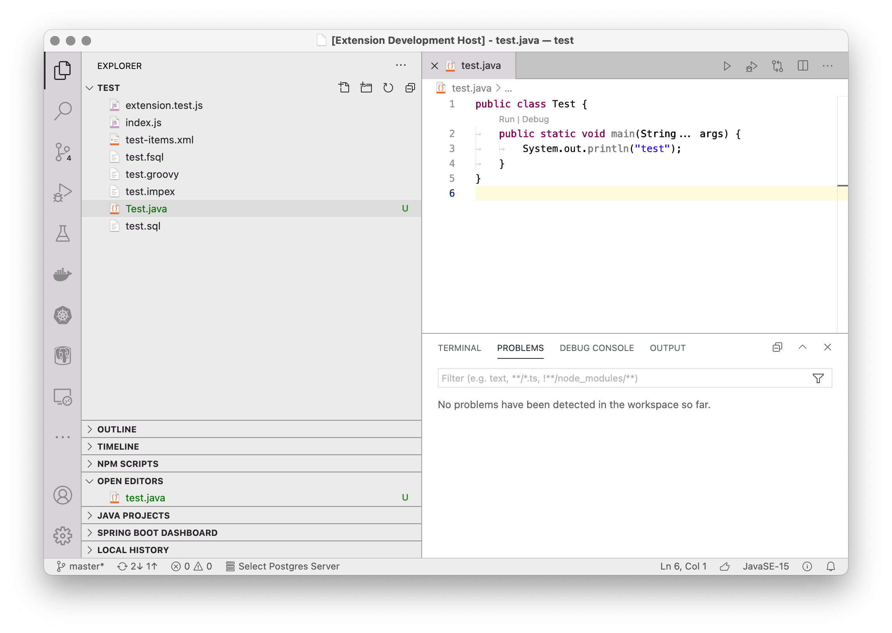

# Eclipse-like light theme for MacOS
This is a theme that uses the Eclipse syntax colors. The UI theme is based on [macOS Classic](https://marketplace.visualstudio.com/items?itemName=huacnlee.theme-macos-classic)

Enjoy!